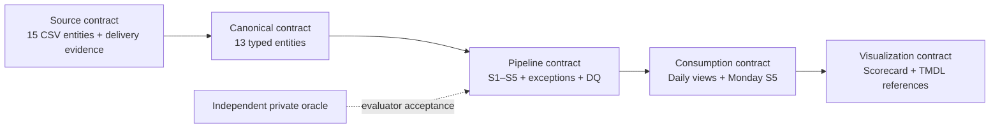

# ODCS adoption and recurring pharma operations · v0.2

The first investigations remain S1–S5. This release adds five ODCS 3.1.0 contract bundles, a reproducible multi-day synthetic source release, a persistent local model, and target deployment assets. The local engine is Python + SQLite, both open source; the contract validator uses open-source `jsonschema`. Snowflake SQL/Python is the target engine. Collibra, Ataccama, Immuta, Airflow and Jenkins are explicit integration boundaries.

The five bundles are authoring and ownership units, not five physical tables. The source bundle contains 15 source entities; the canonical bundle has 13 modeled entities; pipeline and consumption each contain seven outputs; visualization has one scorecard. Split source contracts by producer later if ownership or approval boundaries require it. No production approval has been implied: all five contracts have `status: proposed` and a proposed team owner.



## Contract responsibilities

| Bundle | Responsibilities | Executed local gates |
|---|---|---|
| `contracts/odcs/source.odcs.json` | Column order, source schema editions, text bronze representation, semantic types, business keys, delivery modes and freshness | Official ODCS schema; exact file bytes/counts/headers; ready marker; contract ID/version/hash; reference types/conflicting keys; logical freshness |
| `canonical.odcs.json` | Typed public-source dimensions, versions, intervals and nullable unresolved identity | Required values/types, primary grains, parent references, valid intervals and commercial measures |
| `pipeline.odcs.json` | S1–S5 snapshot grains, exception/DQ outputs, lateness and percentage alert budgets | Contract-driven thresholds/window, structural checks, uniqueness; independent oracle comparison in evaluator/CI |
| `consumption.odcs.json` | Stable analyst datasets and current views | Snapshot grain/type checks; latest complete publication; Monday-only S5 |
| `visualization.odcs.json` | Scorecard grain, dimensions, measures, TMDL asset references and ratio rules | Scorecard types/uniqueness; scoped counts; generated semantic table/column binding |

ODCS describes data products and schemas. Airflow workflows and Power BI / Analysis Services TMDL remain separate artifacts linked through standard ODCS custom properties; they are not presented as native ODCS orchestration or TMDL syntax. ODCS documents use JSON, supported by the official JSON schema, so authoring/runtime do not depend on a YAML parser. TMDL generation uses the Python standard library.

The official schema and Apache license are vendored under `contracts/vendor/`. `ODCS-PROVENANCE.json` records the pinned upstream commit and SHA-256. Schema validation is offline. `build_contracts.py` authors the initial contracts and derived DDL; run it intentionally after reviewing definition changes. Normal operations validate existing contracts and do not regenerate them silently.

## Updated dataset

The default release is `pharma-lab-0.2.0`, seeded with `20261008`, with 14 deliveries from 1–14 October 2026. It contains 100 invented HCPs, 12 HCOs, four products, four territories, eight representatives, five campaigns and 300 historical initial interactions. Business outputs use 99 active approved HCPs; the canonical inventory retains the inactive HCP. These are synthetic logical-time investigations, including future fixture checkpoints, not evidence of actual October source availability.

Initial historical data and delivery boundaries are shifted together from the tested crawl fixture. New deliveries add 24 interactions per day after the first two checkpoints. One prior interaction is corrected or tombstoned on subsequent days; the product details form a complete replacement for each version.

| Delivery/date | Additional investigation event |
|---|---|
| b001 / 1 Oct | Historical bootstrap, campaign boundaries, duplicates, unresolved identities, unknown products, missing territory and consent; active operational campaign |
| b002 / 2 Oct | Existing seven/eight-day late boundaries, correction, tombstone, missing interaction date, consent withdrawal and revised product hierarchy |
| b004 / 4 Oct | HCP 1 withdrawal delivered after its effective time |
| b005 / 5 Oct | Byte-equivalent current product redelivery; first weekly S5 publication and commercial restatement |
| b007 / 7 Oct | Territory realignment delivered after its 6 October effective date; it must not appear in b006 |
| b008 / 8 Oct | Consent restoration |
| b009 / 9 Oct | New product hierarchy interval becomes visible; historical product activity is restated; eight-day-late event quarantined |
| b010 / 10 Oct | Malformed interaction version and missing date quarantined |
| b012 / 12 Oct | Second weekly S5 publication and commercial restatement |

`scenario-events.json` records the added events. The independent evaluator reads canonical truth plus explicit projection/delivery decisions; the builder never reads that truth. A separate ledger entry prevents the oracle learning the late territory update before delivery.

The v0.2 activity feed adds `staff_key` for real representative attribution at activity/version grain and declares source schema edition **2.0**. Other source schemas retain edition 1.0. The ODCS contract version is independently 0.2.0. The legacy `source-projections.json` remains the crawl mapping input; v0.2 extensions are declared in the source ODCS object and generated source-contracts file.

The initial monthly mapping is also supplied as a deterministic XLSX workbook. The standard-library converter verifies byte-identical CSV output and produces a receipt binding workbook and output hashes. Late realignment is an explicit additional CSV delivery. CSV loaders do not attempt to load Excel directly.

## Canonical schema

Every modeled entity has `snapshot_id` in its primary grain. Canonical keys are public source keys, not the evaluator's hidden canonical IDs. This permits inspection and reconciliation without giving the builder an answer crosswalk.

| Entity | Business grain / temporal rule |
|---|---|
| organisation | Approved source organisation key |
| affiliation | Source HCP–HCO relationship interval |
| representative | Public staff key |
| customer | Approved provider inventory, including inactive records |
| product_interval | Product/effective-from interval; half-open end |
| territory | Territory reference key |
| interaction_version | Every structurally accepted interaction/version, including tombstones; retains CRM and resolved customer keys and staff attribution |
| interaction_product | Accepted interaction/version/product; complete detail replacement |
| consent_event | Delivered preference event; future-effective events retained in the model but excluded from current consent selection |
| customer_territory | Delivered assignment interval; latest effective current interval wins; tied conflicting territory fails |
| campaign | Product campaign with inclusive start and exclusive end |
| campaign_member | Enrolled/contact membership with explicit nullable unresolved identity |
| rx_version | Versioned weekly commercial observation; latest version replaces rather than adds |

The private evaluator retains its original 16-entity world. Rep–territory history and hidden identity crosswalks are not invented as public source feeds. The 13 public-derived model entities cover the available feeds and S1–S5. Unknown product codes and unresolved customer references remain diagnosable; approved/consented consumption rules are applied at their specified use case, rather than dropping every imperfect source record globally.

## Local workflow

From the project root:

```sh
python3 -m venv .venv
.venv/bin/python -m pip install -r requirements-dev.txt
make contracts PYTHON=.venv/bin/python
make operate PYTHON=.venv/bin/python
make test PYTHON=.venv/bin/python
```

The delivered project includes the final fixture, local database and acceptance evidence. `make operate` verifies identical replay when those are present. On a fresh source-only checkout it generates the default fixture and hydrates it. `make fixture` intentionally refuses a nonempty output directory: use a new release directory for a new seed/schedule or data change.

`data/operations-release/model_export/b014/` also contains inspectable CSVs for the final modeled/pipeline/consumption/visualization snapshot, with an export manifest. These are exported from the public-source database, not evaluator truth. The S5 consumption CSV is empty for that Wednesday; the live weekly view correctly retains b012. Export another published snapshot with `python3 src/export_model.py --db data/operations/model-v02.sqlite --snapshot b012 --out /tmp/pharma-model-b012`.

Regenerate the TMDL assets and their local CSV sources after publication (b014 is the latest daily checkpoint; b012 is the latest Monday):

```sh
python3 src/export_model.py --db data/operations/model-v02.sqlite --snapshot b014 --out data/operations-release/model_export/b014
python3 src/export_model.py --db data/operations/model-v02.sqlite --snapshot b012 --out data/operations-release/model_export/b012
python3 src/export_model.py --db data/operations/model-v02.sqlite --history --out data/operations-release/model_export/history
make integration-export
```

To publish a single due batch without opening evaluator truth:

```sh
python3 src/hydrate_operations.py \
  --public-root data/operations-release/public_s3 \
  --db /tmp/pharma-model.sqlite --batch b001 --exports /tmp/pharma-b001
python3 src/operate_date.py --date 2026-10-02 \
  --public-root data/operations-release/public_s3 --db /tmp/pharma-model.sqlite
```

Hydrate predecessors first. File ingestion, modeled rows, scenario outputs, quality evidence, consumption and the publication ledger commit in one SQLite transaction. Failed writes roll back; `run_log` retains the failed attempt. Replays require identical manifest bytes and a matching contract registry. One database is bound to one release and registry fingerprint. Changed implementation/contract semantics require a new isolated database or an explicitly reviewed migration; replay preserves published snapshots rather than recomputing them with new logic.

Read `consumption_s01_engagement_current` through `consumption_s04_interaction_current` for the latest complete daily snapshot. `consumption_s05_campaign_current` selects the latest complete Monday snapshot and is empty before the first Monday. All daily S5 diagnostic calculations remain in `pipeline_s05_campaign`. The visualization current view is `visualization_scenario_scorecard_current`; history retains a snapshot dimension.

Percentage `ALERT` rows do not fail correct publication. Structural errors, incompatible contracts, conflicting keys, incorrect types and hard relationship checks do. Notification delivery itself is not implemented; exception/DQ tables and run evidence are the integration inputs for an agreed notification route.

Freshness is currently verified between manifest availability and the logical checkpoint (24-hour budget). S2's 06:30 and S1's 07:00 UTC deadlines remain contract metadata. Historical simulation and timestamping do not prove live wall-clock completion; test these deadlines with actual Airflow runs and source arrivals.

## Cadence and immutable source delivery

`config/operations.json` controls seed, first delivery date, number of daily deliveries (10–90), daily volume and UTC availability/cutoff. Source availability defaults to 05:00 and the reporting cutoff to 06:00. There must be at least ten deliveries to include every investigation event. Changing the release means regenerating into an empty destination with an updated release identity; never overwrite an uploaded release.

The generator creates a finite simulation calendar. It does not serve as a continuously running upstream CRM system. An operational producer supplies new immutable batch files, exact manifests and ready markers with the same contract rules. The loader accepts additional ordered batches within the bound release. Reference intervals/events carry business effectiveness separately from delivery visibility.

Daily activity drives hydration; commercial restatements are weekly; the initial territory workbook is monthly with explicit interim realignment deltas. The source-only runner selects the due manifest from its logical date. A header/count/hash failure blocks publication, and a missing predecessor cannot be silently skipped.

## Snowflake target

```sh
python3 src/render_operations_sql.py \
  --public-root data/operations-release/public_s3 \
  --stage PHARMA_LAB.INGEST.EXISTING_STAGE \
  --schema PHARMA_LAB.PHARMA_MODEL --out build/snowflake
```

The existing stage must expose `public_s3` at its URL root. Use the validated conditional uploader in `upload_public.py`; upload only the public tree. Raw COPY row counts cannot prove remote byte hashes, so remote source integrity depends on that uploader and immutable stage access. Schema and stage names above are illustrative bindings, not provisioned infrastructure.

The renderer produces setup DDL and three scripts per checkpoint: exact-file ingestion, source-only Gold calculation and contract-checked transactional publication. Public canonical tables and consumption snapshots are derived without evaluator access. Snowflake does not enforce primary keys on these standard tables, so explicit uniqueness checks remain required.

The supported target layout co-locates raw source views and the four modeled/published layers in one isolated schema with distinct physical names/prefixes. The contracts and TMDL default to `PHARMA_LAB.PHARMA_MODEL`; bind account/database/schema values to the real deployment in Collibra/Immuta/Power BI configuration. Raw views expose the union of exact batch tables; internal batch/file provenance columns are storage metadata in addition to contracted business fields. Split physical schemas only with an explicit namespace mapping/renderer change.

Install `requirements-snowflake.txt`, configure a named connection and use:

```sh
python3 src/run_operations_snowflake.py \
  --public-root data/operations-release/public_s3 \
  --connection YOUR_NAMED_CONNECTION \
  --stage YOUR_DB.INGEST.EXISTING_STAGE \
  --schema YOUR_DB.PHARMA_MODEL --out /tmp/pharma-cloud-evidence
```

Keep one writer. The harness checks release/registry and replay identity, retains query IDs, exports lowercase headers and normalized types, and rolls back publication on error. Run evaluator reconciliation on every exported checkpoint before using this baseline as cloud acceptance evidence. The scripts have been generated and inspected locally; **no Snowflake execution or account-level parity has been established**. The existing stage, warehouse, authentication, permissions and schema bindings must be supplied by deployment configuration.

## Orchestration, CI and vendor adoption

| System | Delivered asset | Remaining tenant acceptance |
|---|---|---|
| Airflow | `orchestration/dags/pharma_odcs_daily.py`: daily 06:00 UTC, serial catchup, retry, official contract gate, logical-date selection; local or Snowflake adapter | Deploy project/dependencies on workers; configure environment paths/named connection; verify timetable, failed/repaired delivery and actual deadline behavior |
| Jenkins | `Jenkinsfile`: schema/evolution gates, regression/recovery tests, isolated independent recurring acceptance and archived public integration/evidence artifacts | Configure SCM/agents and dependency access; fetch PR target branch; verify jobs actually execute |
| Collibra | 43 contract-bound assets, field definitions, proposed owners/classification and 78 dataset lineage edges under `integrations/collibra/` | Bind domain/community and asset/relation type IDs; map/import handoff; assign real stewards and approval status |
| Ataccama | Contract quality rule handoff under `integrations/ataccama/` | Map to installed ONE rule APIs, parameters and connection; execute parity checks; configure alert route |
| Immuta | Per-object role/purpose/classification intent, consumption view scope and evaluator boundary under `integrations/immuta/` | Configure integration, groups/attributes and policies; prove allowed and denied access |
| Power BI / Analysis Services | Ten TMDL files defining seven semantic tables, 16 DAX measures, CSV/Snowflake Power Query partitions and ODCS annotations | Parse using Microsoft TOM; bind CSV paths or Snowflake parameters; compile DAX, refresh, reconcile measures, and accept access controls |

Collibra/Ataccama/Immuta files are **vendor-neutral handoff records**, not claims of compatibility with a particular proprietary import API. No outbound API writes or tenant policies have been applied. ODCS and local gates remain usable while those adapters are configured.

TMDL means **Tabular Model Definition Language**, the Power BI/Analysis Services serialization of the Tabular Object Model. The semantic model is in `integrations/powerbi/PharmaCommercial.SemanticModel/definition/`; the adjacent `definition.pbism` declares the TMDL-capable semantic model format. The visualization contract alone is patched to version 0.2.1; other contracts and the source dataset release remain 0.2.0. Local databases are bound to the complete registry, so rebuild an earlier model in a new database before swapping it into service.

Identifiers and thresholds have `summarizeBy: none`; analysts use explicit DAX measures. Rates require one scenario, scope and snapshot, use `DIVIDE` on summed numerator/denominator, and return blank for zero denominators and S3/S4 diagnostics. Threshold values are fractions: 0.02 formats as 2%. History totals spanning snapshots return blank. S5 reach counts contacted campaign/customer/product pairs, preserving its contracted grain; it is not a distinct-customer reach metric. Daily scorecard S5 rows remain diagnostics between Monday publications; the separate campaign table reads Monday consumption. Scenario tables are independent with no fact-to-fact relationships or automatic customer joins.

The generated definitions follow [Microsoft TMDL syntax](https://learn.microsoft.com/en-us/analysis-services/tmdl/tmdl-overview), the [Power BI semantic model folder format](https://learn.microsoft.com/en-us/power-bi/developer/projects/projects-dataset), and the [Snowflake connector](https://learn.microsoft.com/en-us/power-query/connectors/snowflake). Local tests check contract bindings and CSV parity; Microsoft TOM parsing, DAX compilation and an actual Power BI/Analysis Services refresh have not been executed. Use `TmdlSerializer.DeserializeDatabaseFromFolder(path)` in a TOM-enabled environment to parse the definition folder, then compile/process on the target engine. Power BI Desktop can load it into an existing TMDL-enabled PBIP semantic model; preserve its report binding and platform metadata. This package contains semantic definitions, not a finished report or PBIP report project.

For local CSV import, set `DataSourceMode` to `CSV`, `DailyCsvFolder` to the absolute `model_export/b014` directory, `WeeklyCsvFolder` to `model_export/b012`, and `HistoryCsvFile` to `model_export/history/visualization_scenario_scorecard.csv`. Generate exports after each successful hydration; choose the latest published Monday for the weekly folder. No private evaluator files are Power Query sources. To target Snowflake, change `DataSourceMode` to `Snowflake` and bind the four Snowflake parameters in `expressions.tmdl`. Credentials live in the client/service connection, not the model files. Import mode caches data; Snowflake/Immuta source policies alone do not establish per-viewer access to that cache. Accept Power BI workspace access/RLS explicitly and schedule service refresh after completed publication. Tenant refresh and report publication remain deployment work.

## Verification and rollout

`tests/test_operations.py` exercises all 14 checkpoints, contract schema/evolution, source binding, nonadditive replay, rollback/repaired retry, malformed record quarantine, historical consent conflicts, late reference delivery, hierarchy restatement, public rep attribution, scoped scorecards, weekly consumption, workbook roundtrip and rendering of the Snowflake scripts. `tests/test_operations.py` also checks TMDL contract/type bindings, DAX field references and seven local semantic data sources against the published daily, Monday and historical rows. These are static and data checks, not Microsoft engine validation. The legacy crawl suite remains intact.

For a deployment pilot, first prove S2/S4 through S3 and the real existing Snowflake stage; then run S3 through the supplied XLSX adapter. Reconcile every row at each checkpoint. Add S1 and S5 after identity, consent, current hierarchy and weekly publication are accepted. Catalog, quality and access-policy handoffs can then be tested against their actual tenants. This is the existing crawl/walk sequence with concrete recurring source/model contracts, not a claim that all five integrations are deployed.

## opharma repository layout

This implementation is imported under `pharma-commercial-lab/` in `opharma`. Run its commands from that directory. The Git PR includes fixtures, CSV exports and evidence; generate the SQLite database with `python3 src/run_operations.py`. The previously supplied ZIP distribution also contains the validated runtime database.
